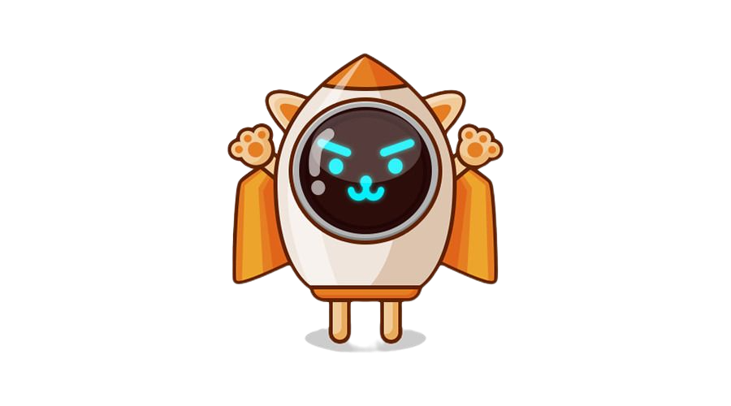

<p align="center">
  <a href="https://github.com/github_username/repo_name">
    
  </a>

  <h3 align="center">Rocket Meow</h3>

  <p align="center">
    A decentralized app built on Ethereum blockchain
    <br />
    <a href="https://rocketmeow.vercel.app/">View Demo</a>
  </p>
</p>

<!-- ABOUT THE PROJECT -->
## About The Project
Rocket Meow is a crowd funding app where inventors can add and showcase their creative projects. Its a great app to attract investors. You can add image and video about your project to gain more attention towards your project. If you already don't have an Ethereum wallet, this app will automatically create a wallet for you where investors can put money.

As an investor, you can browse, like and fund projects. You can invest in projects by purchasing Meow coins. You can also use this app as a wallet to keep your cryptocurrency.


### Built With

* NextJS
* ReactJS
* Solidity
* AWS (For storing images)
* Firebase (For authentication)

<br/>

## Getting Started

To get a local copy up and running follow these simple steps.

### Prerequisites

This is an example of how to list things you need to use the software and how to install them.
* Install Ganache from <a href="https://www.trufflesuite.com/ganache">here</a>: Ganache quickly fire up a personal Ethereum blockchain which you can use to run tests, execute commands, and inspect state.
* Install Metamask chrome extension from <a href="https://metamask.io/">here</a>: Metamask is a crypto wallet & gateway to blockchain apps.

### Installation

1. Clone the repo
   ```sh
   git clone git@github.com:miriamdong/Defi.git
   ```
2. Install yarn packages
   ```sh
   yarn install
   ```
3. Run the project in dev mode
  ```sh
   yarn dev
  ```
4. Run locally via http://localhost:3000
5. If you want to build NextJS website, run following command:
  ```sh
   yarn build
  ```
6. Run production website
  ```sh
   yarn run start
  ```

### Sneak peek
#### Home Page

<br/>
<br/>

#### Create a project

<br/>
<br/>

#### Browse a project

<br/>
<br/>

#### Check Wallet

